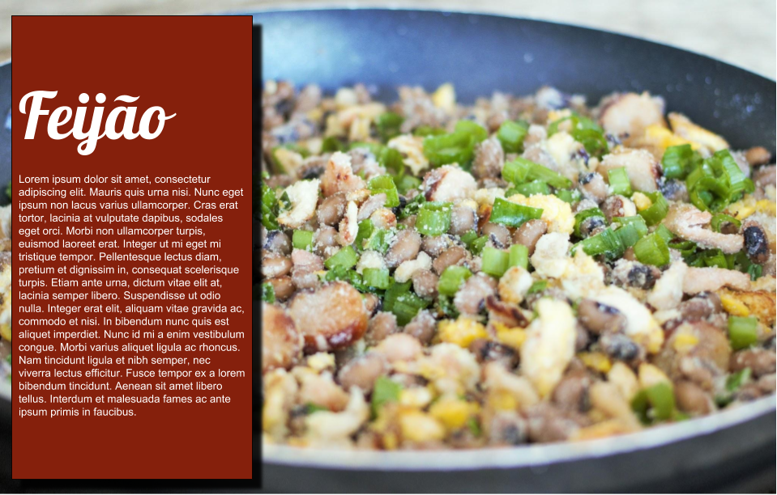

class: center, bottom, inverse

```{r setup, include=FALSE}
options(htmltools.dir.version = FALSE)
```

# Ferramentas profissionais

---
# Corel Draw
- Total liberdade quando ao processo criativo
- Caro

---
background-image: url(fig/corel.png)

---
# InDesing
- Semelhante ao Corel Draw
- Planos de assinatura o tornam atraente
  - Relativamente mais barato

---
background-image: url(fig/indesign.png)
background-position: 50% 50%

---
# Inkscape
- Semelhante ao Corel
- Gratuito
- Única página por arquivo

---
background-image: url(fig/inkscape.png)
background-position: 50% 50%


---
# Exemplo de material feito no Inkscape

<iframe width="800" height="600" src="https://www.youtube.com/embed/9zHZTF7cMs4" frameborder="0" allow="autoplay; encrypted-media" allowfullscreen></iframe>

---
class: center, middle
# O que você já tem no escritório/posto/casa?
No geral, não foram feitos para isso, mas quebram um galho

---
# Power Point
- Slides
- Apresentações
- Possível usar para material impresso
- São opção interessante para banner

---
class: center, bottom, inverse

# Mudando o tamanho do slide para usar impressões a4

---
class: center
<iframe width="800" height="600" src="https://www.youtube.com/embed/qhD2tGF1vx4" frameborder="0" allow="autoplay; encrypted-media" allowfullscreen></iframe>

---
class: center, bottom, inverse

# Banners

---
<iframe width="800" height="600" src="https://www.youtube.com/embed/bh0QciAobQM" frameborder="0" allow="autoplay; encrypted-media" allowfullscreen></iframe>
---
class: center, bottom, inverse

# Imagem como fundo 
Não recomendado para impressão em preto e branco e xerox

---
<iframe width="800" height="600" src="https://www.youtube.com/embed/L1cn9_qJ-Hw" frameborder="0" allow="autoplay; encrypted-media" allowfullscreen></iframe>

---
class: center, bottom, inverse
# Usando em monitores e displays, indefinidamente

---

<iframe width="800" height="600" src="https://www.youtube.com/embed/6qVxwVHD8S4" frameborder="0" allow="autoplay; encrypted-media" allowfullscreen></iframe>

---
class: center, bottom, inverse
# Word

---
# Régua e linhas de grade
- Velhos tempos

<iframe width="560" height="315" src="https://www.youtube.com/embed/7Skp5WY6Ygo" frameborder="0" allow="autoplay; encrypted-media" allowfullscreen></iframe>

---
# 3 Colunas para panfletos

<iframe width="560" height="315" src="https://www.youtube.com/embed/n0kKwIHgKGE" frameborder="0" allow="autoplay; encrypted-media" allowfullscreen></iframe>

---

# Formas
- Pressione e segure shift para manter a proporção de figuras
- Também funciona com PowerPoint

<iframe width="560" height="315" src="https://www.youtube.com/embed/mKFGE-U6iSo" frameborder="0" allow="autoplay; encrypted-media" allowfullscreen></iframe>

---
# SmartArt
Organogramas não são mais problema

<iframe width="560" height="315" src="https://www.youtube.com/embed/mFkK7TKYqiQ" frameborder="0" allow="autoplay; encrypted-media" allowfullscreen></iframe>

---
# Publisher
A ferramenta de escolha para folders

<iframe width="560" height="315" src="https://www.youtube.com/embed/h6FtQLvpIu8" frameborder="0" allow="autoplay; encrypted-media" allowfullscreen></iframe>

---
class: center, bottom, inverse
# Ferramentas online

---
# Canva

- Melhor da lista
- https://www.canva.com
- Bons modelos
- Pesquisa de imagens é bastante útil
- Marca d’água em imagens que que foram buscadas pela ferramenta
- Possibilidade de uso de imagens externas
- Preços para uso único são baixos 
  - 1 U$
- Exporta  em alta qualidade e pdf
- Google e facebook ids como login
- Tutoriais
  - https://www.canva.com/learn/design/tutorials/ 

---

<iframe width="800" height="600" src="https://www.youtube.com/embed/oPvDOLIDDD8" frameborder="0" allow="autoplay; encrypted-media" allowfullscreen></iframe>

---
# Piktochart

- Infográficos
- Piktochart
- https://piktochart.com/
- O forte dele são infográficos
- Grande quantidade de ícones
- Nível gratuito não permite exportação em pdf ou alta qualidade
- Qualidade média é passável para impressões pequenas ou xerox

---

<iframe width="800" height="600" src="https://www.youtube.com/embed/LdRMqJWyvik" frameborder="0" allow="autoplay; encrypted-media" allowfullscreen></iframe>

---

# easel.ly

- https://www.easel.ly
- Comparável ao piktochart
- Uso de gráficos é facilidade
- No nível gratuito, só pode ser exportado para imagens em baixa qualidade
- No máximo, é possível usar para uma página/serviço de internet

---

<iframe width="800" height="600" src="https://www.youtube.com/embed/Q249nGdkVfs" frameborder="0" allow="autoplay; encrypted-media" allowfullscreen></iframe>

---
# Drawings
- https://docs.google.com/drawings/
- Google Drawings
- Gratuito
- Exporta para pdf e alta qualidade
- Útil para diagramas e designs mais simples
- Não há templates ou modelos para começar o trabalho

---

<iframe width="800" height="600" src="https://www.youtube.com/embed/C-b0g3t1y-s" frameborder="0" allow="autoplay; encrypted-media" allowfullscreen></iframe>

---


---
class: center, middle, inverse
# Ferramentas são só ferramentas
Conteúdo e forma é que são importantes